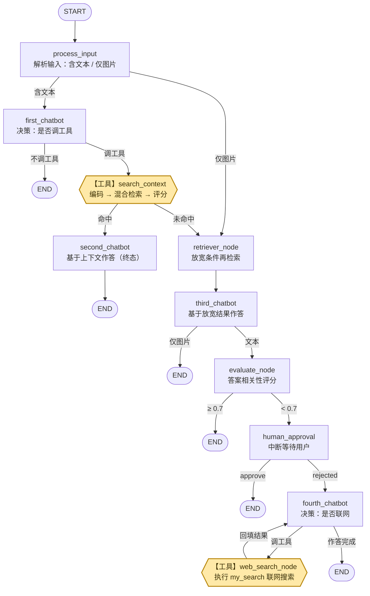

# 多轮对话 RAG 工作流执行流程

> 本文档描述 `graph/` 多轮对话 RAG 工作流的完整执行流程。
> 命令行入口（`workflow.py`）与 Gradio 界面入口（`workflow_gradio.py`）
> **共用 `graph_builder.py` 中的唯一一份图定义**，流程完全一致，
> 两个入口只保留各自的输入 / 输出外壳。

## 流程总览



> **图例**：**六边形 + 黄底**的两个节点是**工具节点**（`【工具】`，由 LLM 通过 function calling
> 触发，不由 prompt 直接驱动）——`search_context` 检索该用户的历史对话上下文，
> `web_search_node` 是承载 `my_search`（联网搜索工具）的 ToolNode。
> 其余节点为 LLM 节点或逻辑节点。边上的文字是该条边的触发条件。
>
> 注意 `search_context` 是**条件分支的源头**：它同时引出「命中」和「未命中」两条边，
> 命中走 `second_chatbot`，未命中才走 `retriever_node`，不是顺序执行的三步。

## 分阶段说明

### ① 输入解析（process_input）

解析用户消息，判定本轮输入类型写入状态：`has_text`（含文本）或 `only_image`（仅图片）。
含文本走 `first_chatbot`；仅图片跳过对话模型，直达 `retriever_node`。

### ② 历史上下文检索（first_chatbot → search_context）

- `first_chatbot` 绑定 `search_context` 工具，由模型决定是否调用；
  不调工具则直接生成回答并结束。
- `search_context` 内部三步：
  1. **本地嵌入编码**：把问题向量化（全链路统一嵌入模型）；
  2. **Milvus 混合检索**：在 `t_context_collection` 上做 dense + BM25 的 RRF 混合检索，
     按 `username` 过滤（只检索该用户自己的历史对话）；
  3. **ragas 上下文相关性评分**：低于 `CONTEXT_SCORE_THRESHOLD` 的检索结果会被清空。

### ③ 命中 / 未命中分支（route_llm_or_retriever）

路由函数只看工具返回是否为空、是否为约定的兜底文案，不重复计算分数：

- **命中** → `second_chatbot` 基于检索到的历史上下文作答。
  这是图的**终态**，不再接评估节点，直接 END。
- **未命中**（检索无结果，或评分被清空）→ `retriever_node` 放宽条件再检索一遍，
  结果写入 `context_retrieved`，交给 `third_chatbot` 作答。

> **为什么未命中还要再作答一次？**
> 因为走到未命中分支时，流程里**还没有任何答案**：`first_chatbot` 那次 LLM 调用只做了
> 「调工具」的决策（system prompt 明确禁止它凭内部知识回答），此时 ToolMessage 里只有
> 兜底文案。而**未命中 ≠ 库里没有内容**——可能只是严格路径的三道关（LLM 查询改写质量、
> username 过滤、0.5 评分门槛）卡掉了边缘相关的内容，所以 `retriever_node` 放宽条件
> （无门槛）再检索一次，交给 `third_chatbot` 生成**本路径的第一个答案**。
>
> 不让 `second_chatbot` 兼任这条路径的作答，有两个原因：
> ① 上下文通道不同——`second_chatbot` 读的是工具返回的 ToolMessage，
> 而放宽检索结果在 `context_retrieved` 状态字段里，各成一个节点最清晰；
> ② 把关强度不同——严格路径已过 0.5 门槛、置信度高，`second_chatbot` 答完即终态；
> 放宽路径没有门槛，所以 `third_chatbot` 的答案要继续走
> `evaluate_node` → 人工审批的降级把关，不合格再联网兜底。

### ④ 答案评估（route_evaluate_node → evaluate_node）

- 仅图片输入跳过评估直接 END；文本输入进入 `evaluate_node` 计算 AnswerRelevancy。
- 评分 **≥ `ANSWER_SCORE_THRESHOLD`** → END，答案走写库；
- 评分 **< 阈值** → 进入人工审批。

### ⑤ 人工审批（human_approval，interrupt_before）

图在编译时设置 `interrupt_before=['human_approval']`，到达此节点时**工作流中断**，
把决定权交给用户：

- `approve` → END，接受当前答案；
- `rejected` → `fourth_chatbot` ⇄ `web_search_node` 联网兜底循环：
  `fourth_chatbot` 绑定 `my_search` 联网搜索工具（`graph/tools.py` 中的 `@tool` 函数，
  底层调用智谱 web_search），模型决定调用 → `web_search_node`（ToolNode 工具节点）
  执行搜索并把结果以 ToolMessage 回填 → 模型基于结果继续作答，
  直到不再调工具，生成最终答案 → END。

> **`rejected` 会同时作废 `evaluate_score`**（见 `graph_builder.update_state`）。
> `evaluate_score` 是 state 里的单个字段，由 `evaluate_node` 在「评估那一刻」写入，
> 之后不会自动更新 —— 它描述的是**刚被否决的那条答案**。联网兜底会生成一条全新答案，
> 旧分数对它毫无意义；若不清除，收尾写库会拿旧分数去判定新答案。冷启动场景下
> 旧分数几乎必然是低分（被评的是「没有检索到」之类的兜底话术），
> 结果就是联网搜到的好答案被一并拦在库外。

### ⑥ 收尾写库（图外逻辑，两入口共用）

工作流结束后，入口检查 `graph.get_state(config).next`：

- **非空**（本轮停在审批中断）→ 不写库，等用户回复审批；
- **为空**（本轮正常走完）→ 调用 `save_final_answer()` 写入 `t_context_collection`。

写入器内部依次过三道闸门：

| 闸门 | 规则 |
|---|---|
| 质量闸门 · 兜底特征 | 回答命中兜底话术特征即不入库。覆盖两条链路：本地检索路径的「没有检索到…」系，以及联网兜底路径的空结果措辞（「未找到相关网络资料」等） |
| 质量闸门 · 相关性分数 | 答案相关性低于 `MIN_EVAL_SCORE_TO_SAVE` 的回答不入库。**分数必须与答案同源才有效**：`rejected` 之后分数已被作废（置空），此时闸门自动跳过该项，只靠兜底特征把关 |
| 幂等闸门 · 问题级 | `question` 字段存归一化提问（抹掉空白/标点并转小写），写入前服务端等值匹配，同一问题不落第二条 |
| 幂等闸门 · 内容级 | 答案向量与库内 top-1 相似度 ≥ `DUP_SIM_THRESHOLD` 视为已有等价内容，跳过写入 |

另有来源标记：本轮轨迹里出现过 `my_search` 的 ToolMessage，`message_type` 记
`WebSearch`（联网检索所得），否则记 `AIMessage`（历史上下文所得）。

> 兜底特征必须覆盖**两条链路**：`rejected` 之后不再有分数兜底，联网兜底路径的空回答
> 只能靠特征表拦住。漏掉的话，这类含用户提问词的空回答会写回库、下一轮被命中，
> 把「冷启动自锁」搬到联网路径上重演。

## 完整操作步骤（一次真实对话的全流程）

按时间线走一遍：**每一步你做什么、看到什么、系统在做什么、下一步怎么办**。
以 Gradio 界面为例（CLI 相同，只是输入换成终端下一行文字）。

### 第 1 步：启动服务

```bash
HF_HUB_OFFLINE=1 TRANSFORMERS_OFFLINE=1 python -m graph.workflow_gradio
```

启动日志里先看到嵌入模型预热（服务启动阶段完成，不计入你的等待时间），
之后浏览器打开 `http://127.0.0.1:7860` 即可使用。

### 第 2 步：输入问题

在输入框输入问题（如 `Checkpoint 和 Savepoint 有什么区别？`）并发送。
输入框会暂时变为不可编辑——这是正常的，回答生成期间不接受新输入。

此时系统在后台依次执行：检索历史上下文 →（未命中时）放宽检索 → 生成回答 → 相关性评估。
界面上你会依次看到：

1. 「🔍 正在检索历史对话上下文，请稍候…」占位提示（回答开始输出时原地消失）；
2. 🛠️ 工具调用气泡（调了 `search_context`，以及联网时的 `my_search`）；
3. 回答正文（流式逐字输出）。

### 第 3 步：看回答来自哪条路径

这一步**你不需要做任何操作**，但知道来源有助于判断第 4 步怎么办：

| 界面表现 | 走的路径 | 是否需要你审批 |
|---|---|---|
| 直接给出完整回答，没有审批提示 | 命中历史上下文（`second_chatbot`），已过质量门槛 | **不需要**，本轮已结束 |
| 出现「您是否认可以下输出？」的提示 | 本地没答好（未命中或评分低于阈值），进入人工审批 | **需要**，见第 4 步 |

### 第 4 步：审批（仅当出现认可提示时）

系统会停下来等你输入，**只有两个有效词**：

- 输入 **`approve`** —— 接受当前答案，流程结束。当前答案会走写库闸门后入库；
- 输入 **`rejected`** —— 否决当前答案，系统自动联网兜底：`fourth_chatbot`
  调用 `my_search` 搜索 → 基于搜索结果**重新生成一条全新答案** → 流程结束。
  新答案通过写库闸门后入库（`message_type=WebSearch`）。
  被否决的那条答案不会入库，其评估分数也会被作废，不影响新答案。

> 两个注意点：
> ① 审批输入**必须是这两个词本身**，输别的（如「可以」「不行」）不会被识别为审批，
> 会被当成新问题开启新会话（旧中断被放弃）；
> ② 审批提示出现后，**回答还没有入库**——流程停在中断点，等你回复后才继续走到写库。

### 第 5 步：再次提问（验证闭环）

- **换不同的问题** → 正常走检索流程；
- **问同一个问题**（哪怕排版不同：多了空格、标点、大小写差异）→ 直接命中第 4 步
  刚入库的答案，走 `second_chatbot` 路径秒回，**且不会重复入库**（问题级幂等）。

到此一个完整闭环结束：**提问 → 未命中兜底 → 审批 → 入库 → 下次命中直接复用**。
库中的知识就是这样一轮一轮积累起来的。

### 附：仅图片输入的路径

不发文字、只上传图片时，跳过对话与审批，直接 `retriever_node` → `third_chatbot`
基于图片内容作答，答案直接输出并走写库，**全程无需审批**。

## 阈值常量参考

| 常量 | 当前值 | 定义位置 | 含义 |
|---|---|---|---|
| `CONTEXT_SCORE_THRESHOLD` | `0.5` | `graph/tools.py` | 上下文相关性门槛，低于则清空检索结果 |
| `CONTEXT_EVAL_TIMEOUT` | `30` 秒 | `graph/tools.py` | 上下文评委超时上限；超时按「无法判定 → 放行检索结果」处理 |
| `ANSWER_SCORE_THRESHOLD` | `0.7` | `graph/all_router.py` | 答案相关性门槛，低于则转人工审批 |
| `ANSWER_EVAL_TIMEOUT` | `60` 秒 | `graph/evaluate_node.py` | 答案评委超时上限；超时按低分处理，走人工兜底 |
| `MIN_EVAL_SCORE_TO_SAVE` | `0.3` | `graph/save_context.py` | 写库质量门槛 |
| `DUP_SIM_THRESHOLD` | `0.95` | `graph/save_context.py` | 内容级去重相似度阈值 |

> 调整阈值只需改常量定义处；上表数值为撰写本文档时的当前值，以代码为准。

## 两个入口的差异（只有交互，没有流程）

| | `workflow.py`（CLI） | `workflow_gradio.py`（界面） |
|---|---|---|
| 输入 | 终端文本；文本和图片路径用 `&` 分隔 | 多模态聊天框（文字 + PNG） |
| 流式方式 | `stream_mode='values'`，按节点打印 | `['messages', 'updates']`，token 级流式 + 工具调用气泡 + 「正在检索…」占位提示 |
| 审批恢复 | 下一行输入 `approve` / `rejected` | 同样；但用户不回审批直接问新问题时，自动开新 thread 放弃旧中断 |
| 额外动作 | 无 | 启动时预热嵌入模型，把权重加载从用户第一句话挪到启动阶段 |

例如：

```markdown
有界流和无界流有什么区别？
Flink 是如何保证 exactly-once 语义的？
Checkpoint 和 Savepoint 有什么区别？
Flink 的状态管理机制是怎样的？
流处理和批处理的核心差异是什么？
Apache Flink 和 Spark Streaming 在容错机制上有什么不同？
Event Time 和 Process Time 的区别是什么？
```

## 运行方式

必须从**项目根目录**以模块方式启动（直接跑脚本会因项目根不在 `sys.path` 报
`No module named 'graph'`）；无外网环境建议前置离线变量，避免嵌入模型加载时
对 HuggingFace 发起校验请求而长时间等待：

```bash
HF_HUB_OFFLINE=1 TRANSFORMERS_OFFLINE=1 python -m graph.workflow         # 命令行问答
HF_HUB_OFFLINE=1 TRANSFORMERS_OFFLINE=1 python -m graph.workflow_gradio  # Gradio 界面
```
